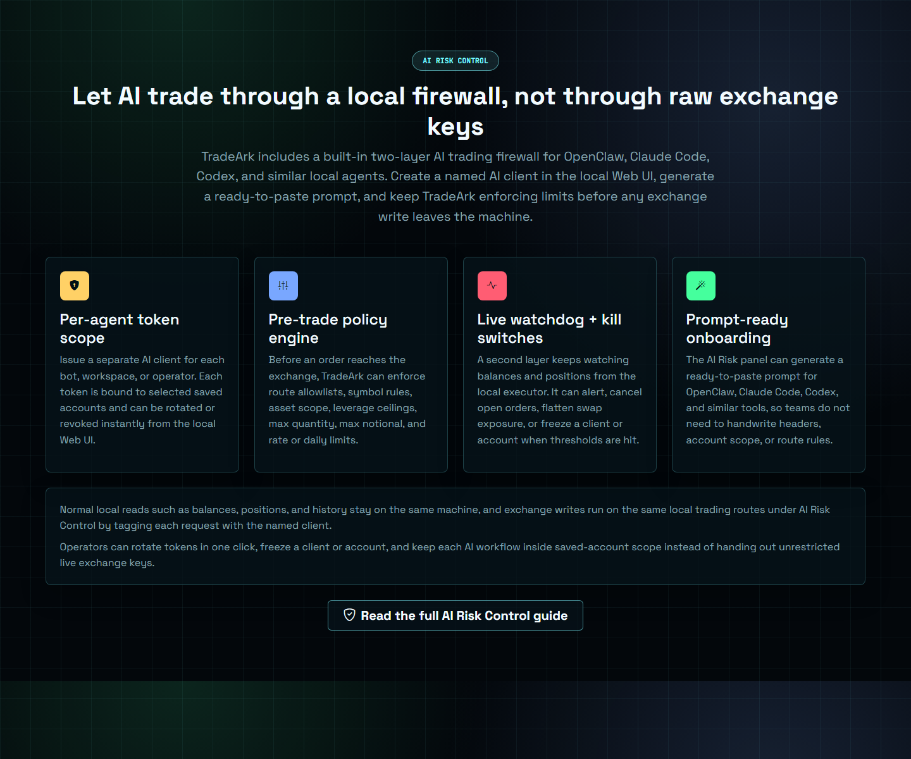

# AI 防火墙

TradeArk 内置了一层本地 AI 风控防火墙，面向 OpenClaw、Codex、Claude Code 以及类似的本地代理工作流。它的目标很直接：让 AI 可以使用本地交易能力，但不需要把无限制的原始交易所密钥直接交给 AI。

## 它主要保护什么

这层防火墙主要拦在 AI 客户端与交易写操作之间，例如：

- 下单
- 撤单
- 撤销全部未成交订单
- 一键平仓
- 修改杠杆或保证金模式

像余额、持仓、历史、交易对、行情这类读请求，依然可以在同一台本地机器上正常使用。防火墙重点处理的是流程从“观察”进入“写入”的那一刻。

## 两层结构

TradeArk 不是只做一层前置校验，而是分成两层：

### 1. 预下单策略层

在写请求真正转发到交易所之前，TradeArk 可以先检查：

- 这个 AI 客户端允许访问哪些已保存账户
- 允许走哪些路由
- 允许哪些交易对或市场类型
- 杠杆上限
- 最大数量或最大名义价值
- 日限额或频率限制

只要请求超出范围，就会先在本地被拦住，不会直接送到交易所。

### 2. 事后 watchdog 监控层

当仓位或风险敞口已经出现之后，第二层本地监控还会继续盯着余额、挂单和持仓。根据你的配置，它可以：

- 发出告警
- 取消未成交订单
- 平掉合约仓位
- 冻结对应 AI 客户端
- 冻结对应账户

所以这层防火墙不只是“提前拦截错误请求”，也负责在已经放行的流程开始偏离时继续介入。

## 一套典型接入流程

如果你准备接外部本地 AI 工具，建议按这个顺序上线：

1. 先在本地 Web UI 里创建一个命名 AI 客户端。
2. 只绑定它真正需要操作的保存账户。
3. 初期先把允许的路由范围收紧。
4. 在开写权限之前先设置杠杆、数量、名义价值和频率限制。
5. 从 UI 里生成可直接粘贴的 prompt 或客户端说明。
6. 先跑只读模式或测试网模式。
7. 整条链路验证通过后，再逐步开放真实写路由。

## 操作者上线前必须确认

在把 AI 工作流接到实盘写操作之前，至少确认：

- 目标账户就是你要用的那一个
- 市场类型和交易对范围正确
- 交易所权限与目标流程匹配
- 同一环境下手动单已经能够成功
- TP / SL 已在那个交易所环境里验证过
- 你已经理解 watchdog 触发后的行为

## 这层防火墙不替你做什么

防火墙会增强控制力，但它不能替代操作者判断。

- 它不会把一个糟糕策略自动变成好策略。
- 它不能修复本来就权限过大的交易所账户。
- 它不能替代测试网验证。
- 它也不意味着你可以跳过小资金灰度流程。

## 实际使用建议

- 尽量使用 `account_id` 和本地已保存账户，而不是每次请求都重复传原始密钥。
- 最好为每个工作流、Bot 或操作者分配独立命名客户端，不要多个流程共用一个 token。
- 当工作流换人、换用途或换权限时，及时轮换或吊销客户端。
- 如果一个流程只需要分析，就保持只读，不要暴露写路由。

## 下一步看哪里

- 想看 AI Provider 和模型配置，继续看 [AI 模型窗口](ai-model-center.md)。
- 想看图表区里的 AI 功能入口，继续看 [右下角 AI 分析](ai-chart-analysis.md)。
- 想看脚本接入和路由级细节，继续看 [API 附录（高级）](../reference/api.md)。
